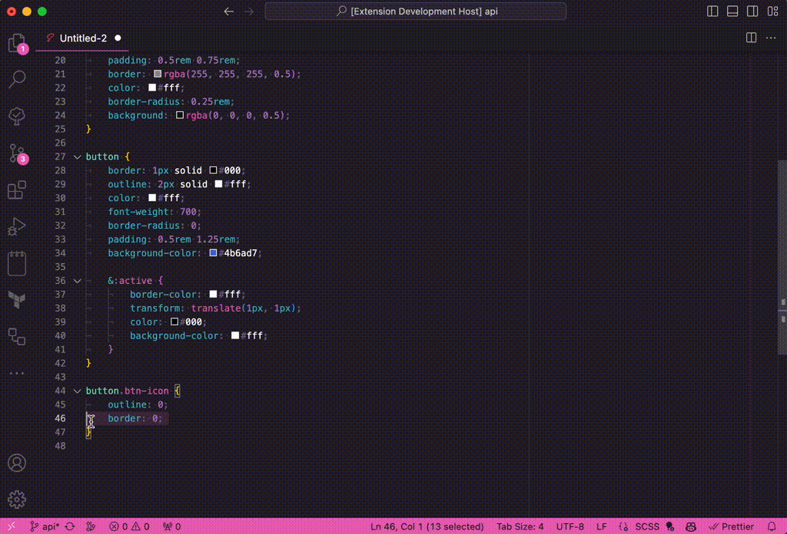

# CSS Alphabetize

[](https://marketplace.visualstudio.com/items?itemName=polymermallard.css-alphabetize)
[](https://marketplace.visualstudio.com/items?itemName=polymermallard.css-alphabetize)
[](https://www.patreon.com/mattkenefick)
[](https://paypal.me/polymermallard)

Alphabetizes properties within your CSS/SASS files.



## Usage

Defaults to alphabetizing the entire file's properties, but can also isolate to selections. If you want to alphabetize a selection, make sure you select an entire block. e.g.

```
div {
    color: red;
    background: blue;
}
```

Rather than:

```
    color: red;
    background: blue;
```

## Configuration

You can adjust the brackets to use this plugin more generically. It defaults to curly braces `{` / `}` but could be adjusted to anything you want deemed as an opening / closing.

## Key Bindings

`shift+alt+a` will alphabetize your file / selection

## Release Notes

### 0.3.1

-   Sort margin before margin-left

### 0.3.0

-   Fix issue #4 about media queries
-   Fix incorrect sorting of background urls
-   Remove extra spaces between nested blocks
-   Trim empty line space
-   Add another command "CSS Sort Properties"

### 0.2.0

-   Break out functions into individual files
-   Add a couple tests
-   Fixes for superfluous line additions
-   Fixe for direct descendant in SASS blocks
-   Changed replacement marker to shebang

### 0.1.1

Update icon + key command in README

### 0.0.1

Initial creation of CSS Alphabetize
